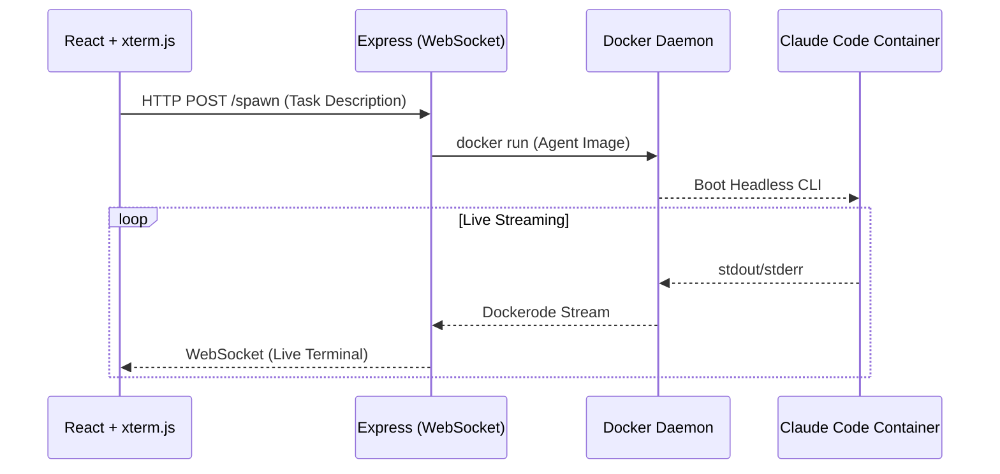

<p align="center">
  
</p>

<h1 align="center">⚡ FatherClaude</h1>

<p align="center">
  <strong>The ultimate open-source runtime for self-hosted AI agents.</strong><br>
  <em>Spawn, watch, and control sandboxed Claude agents directly from your browser.</em>
</p>

<p align="center">
  <a href="https://github.com/seed-gpt/fatherClaude/blob/main/LICENSE">
    
  </a>
  <a href="https://github.com/seed-gpt/fatherClaude/stargazers">
    
  </a>
  <a href="https://github.com/seed-gpt/fatherClaude/issues">
    
  </a>
  <a href="https://agentsbooks.com">
    
  </a>
</p>

<p align="center">
  <!-- TODO: Replace with an actual GIF/video of the streaming UI in action -->
   
</p>

---

## 🌍 Why FatherClaude?

As AI models evolve in 2026, executing complex coding tasks requires more than just a chat interface. It requires an environment. **FatherClaude** provides a robust, fully-isolated Docker sandbox specifically designed for [Claude Code](https://code.claude.com). 

We bridge the gap between agent reasoning and your local environment. You provide the prompt; FatherClaude spins up the container, hands Claude the keys (skills and MCP servers), and streams every line of thinking, executing, and debugging live to a beautiful React-powered web interface. Say goodbye to environment pollution and say hello to scalable, observable agent workflows.

## ✨ Features

- 🐳 **Secure Sandboxing**: Complete Docker isolation. Your local machine is safe while Claude has full access to the sandboxed filesystem, shell, and web.
- ⚡ **Live Streaming UI**: Real-time websocket terminal streaming (powered by React + xterm.js). Watch Claude work as if it's typing on your machine.
- 🔌 **Skills & MCP Ready**: Native support for the Model Context Protocol. Load your environment with custom tools and standard `skills.sh` definitions.
- 🛡️ **Budget Control**: Hard-stop maximum USD budget limits baked into every session. Never worry about runaway inference costs.
- 🌐 **One-Click Deploy**: Run a local fleet of agents with standard Docker Compose.

---

## 🚀 Quick Start (Zero Friction)

### 1. Prerequisites
- **Node.js 20+**
- **Docker Desktop** (Make sure the daemon is running)
- An **Anthropic API Key** ([Get one here](https://console.anthropic.com/))

### 2. Install & Configure

```bash
git clone https://github.com/seed-gpt/fatherClaude.git
cd fatherClaude
npm install

# Set your API key
export ANTHROPIC_API_KEY="sk-ant-..."
```

### 3. Build & Launch

```bash
# Build the specialized Claude Code container image
npm run docker:build

# Start the React UI and Express bridging server
npm run dev
```

> Open [**http://localhost:5173**](http://localhost:5173) in your browser. Describe your task, click **Spawn Agent**, and enjoy the show!

#### Or, if you prefer Docker Compose:
```bash
export ANTHROPIC_API_KEY="sk-ant-..."
docker compose up
```

---

## 📐 Architecture Overview

FatherClaude is built for absolute observability and control over agent execution.



| Layer | Technology Stack |
|-------|------------------|
| **Frontend** | Vite + React + TypeScript + xterm.js (Styling via Vanilla CSS/GitHub Dark) |
| **Backend**  | Express + `ws` + Dockerode |
| **Agent**    | Claude Code CLI (headless, unpermissioned within its own container) |

---

## ⚙️ Configuration

Control your setup entirely through environment variables.

| Variable | Default Value | Description |
|---|---|---|
| `ANTHROPIC_API_KEY` | *(Required)* | Your core API token for LLM access. |
| `PORT` | `3001` | Express backend server port. |
| `MAX_BUDGET` | `5` | Maximum USD spend per containerized agent session. |

## 🏗️ Project Layout

```text
fatherClaude/
├── src/                  # Vibrant React frontend UI
│   ├── components/       # ChatPanel, TerminalPanel, SessionList
│   └── index.css         # Modern, glassmorphism design system 
├── server/               # Orchestration backend
│   ├── api.ts            # REST routes for launching agents
│   ├── ws.ts             # WebSocket bridge to stream stdout/stderr
│   └── docker.ts         # Docker API integration (Dockerode)
├── docker/               # The sandbox blueprints
│   ├── Dockerfile.claude # Headless container definition
│   └── workspace/        # Seed data for agents
│       ├── CLAUDE.md     # Primary system prompt and instructions
│       └── mcp_servers.json
└── docker-compose.yml    # One-click deployment
```

---

## 🤝 Community & Contributing

FatherClaude is designed to be highly extensible. We actively encourage the community to contribute new MCP servers, customized Dockerfiles for specific languages (Python, Go, Rust), or integrations with external skill platforms. 

PRs are completely welcome! For major architectural changes, please open an issue first to discuss your idea.

## 📄 License

This project is licensed under the MIT License — see the [LICENSE](./LICENSE) file for details.

---

<p align="center">
  <br />
  Built with ❤️ by <a href="https://agentsbooks.com"><strong>AgentsBooks</strong></a><br/>
  <em>The AI-Powered Multi-Agent Management Platform</em>
</p>
